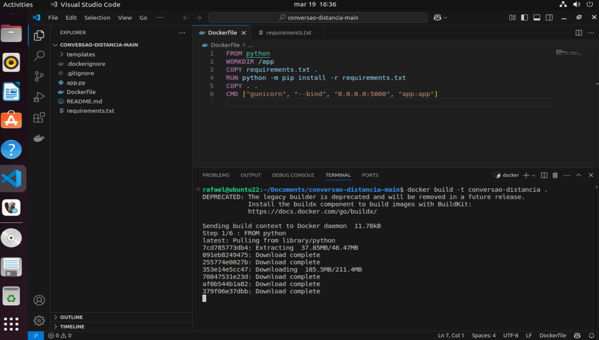
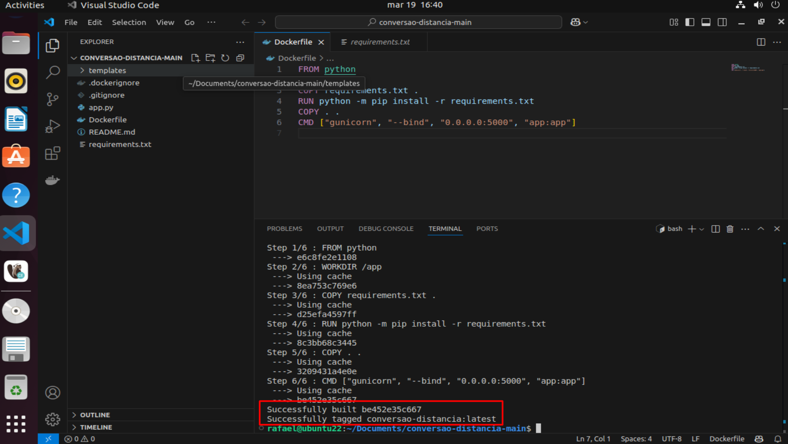
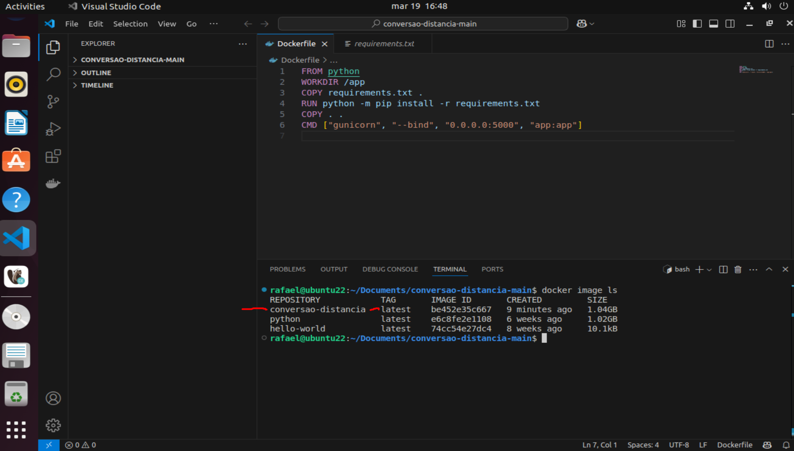
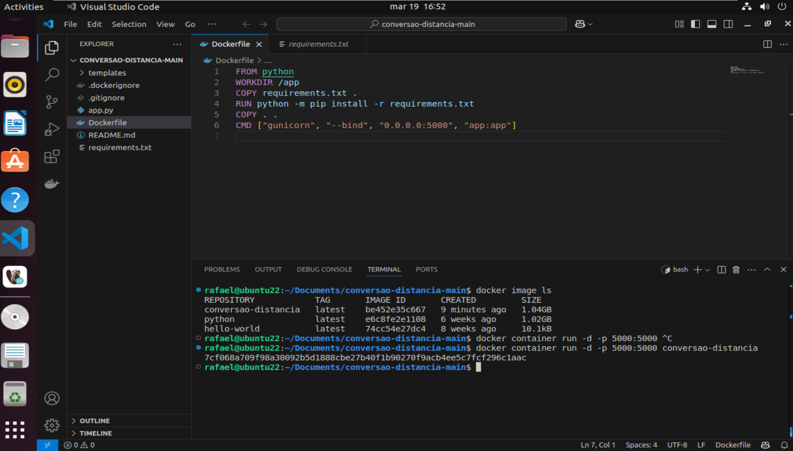
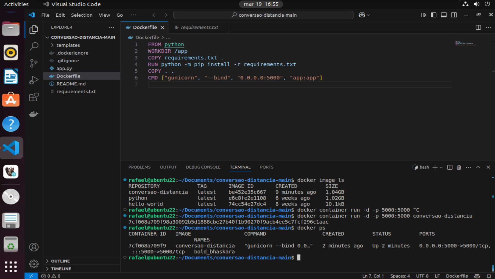
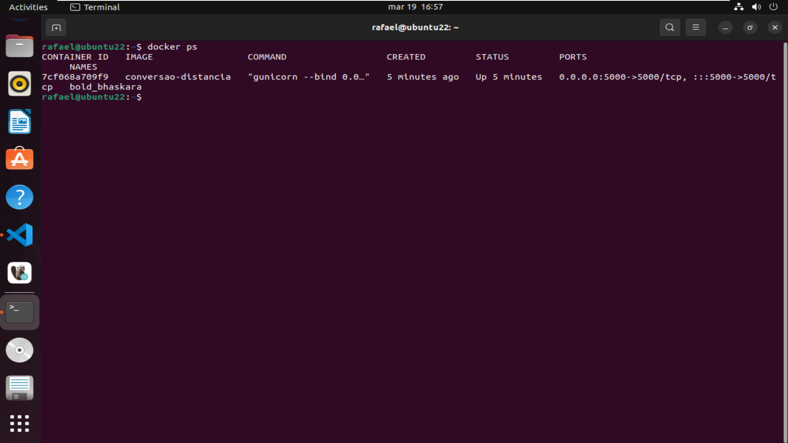
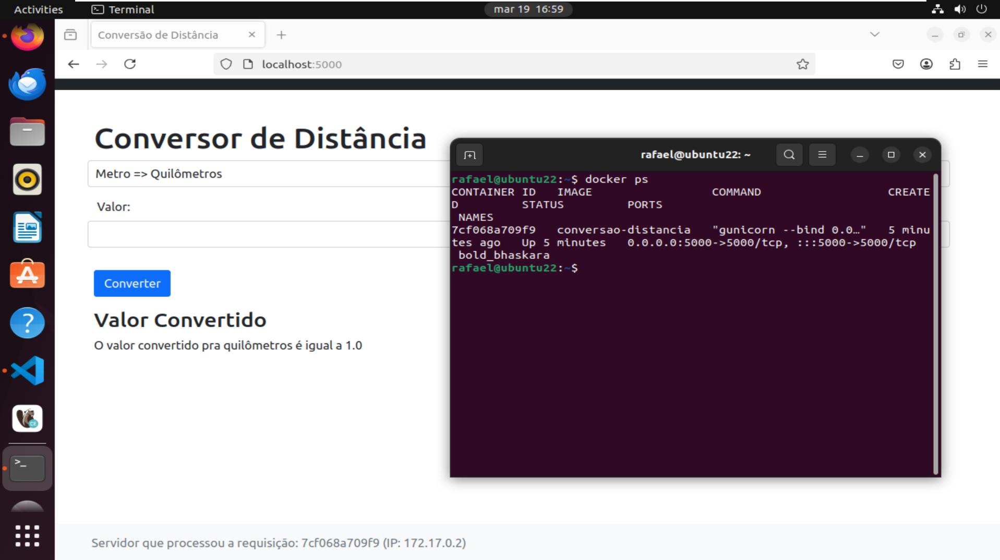

# conversao-distancia🚇

Um aplicativo de "Conversão de Distâncias" geralmente tem a função de ajudar os usuários a converter valores entre diferentes unidades de medida de distância. Ele pode ser útil em diversas situações, como cálculos científicos, planejamento de viagens ou estudos.

- As funcionalidades comuns incluem:

- Conversão de unidades métricas e imperiais: Como quilômetros (km), metros (m), milhas (mi), jardas (yd), pés (ft), entre outros.

- Interface simples e intuitiva: Permite ao usuário inserir um valor, escolher a unidade de origem e a unidade de destino.

- Velocidade e praticidade: Faz as conversões em tempo real.

- Personalização: Em alguns casos, o app permite definir unidades favoritas ou acessar histórico de conversões.

# 1. Configuração do Ambiente🚇
- criado arquivo DockerFile
- criado pasta img com as imagem do processo do ambiente com comandos executados.

# 2. Criação e Teste do Contêiner
## Geração da imagem Docker a partir do Dockerfile criado.
- comandos executados:
- rafael@ubuntu22:~/Documents/conversao-distancia-main$ docker build -t conversao-distancia .
- rafael@ubuntu22:~/Documents/conversao-distancia-main$ docker container run -d -p 5000:5000 conversao-distancia
- rafael@ubuntu22:~/Documents/conversao-distancia-main$ docker ps
- digitar na URL: localhost:5000 isso abre a aplicação no browser.

# 3. imagems do processo de execucao
##

##

##

##

##

##

##

